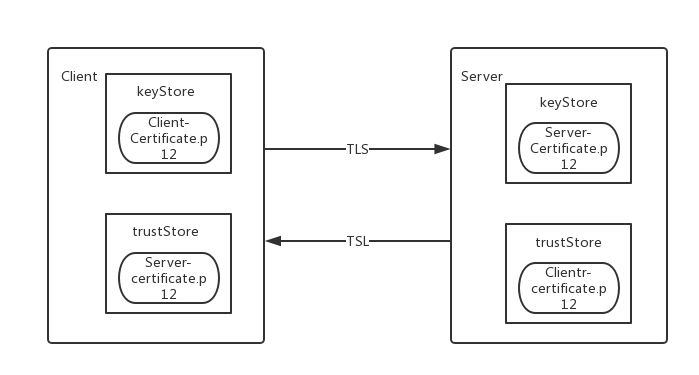

#### Simple Java SSL/TSL Socket Server 

##### 1. What is the role of public key and private key.

* Public key is used to encrypt the information. 
* Private is used to decrypt the information. 

##### 2. What is the difference between digital signature and encryption ?

* When Encrypting, you use their public key to write message, and they use their private key to decrypt to read it. 
* When signing, you use your own private key to write message’s signature, and they use your public key to verify if the message is yours. 

##### 3. What is the difference between keystore and truststore

* A keystore has certs and keys in it and defines what is going to be presented to the other end of a connection.
* A truststore has just certs in it and defines what certs that the other end will send are to be trusted. 

##### 4. The standard handshake for SSL/TSL

he standard SSL Handshake

1. Client Hello (Information that the server needs to communicate with the client using SSL.)  
   * SSL version Number 
   * Cipher setting (Compression Method) 
   * Session-specific Data 
2. Server Hello  
   * Server picks a cipher and compression that both it and the client support and tells the client about its choice, as well as some other things like a session id. 
   * It presents its certificate ( This is what client needs to validate as being signed by a trusted CA.) 
   * It presents a list of certificate authority DNs that client certs may be signed by. 
3. Client response 
   * The client continues the key exchange util necessary to set up a TLS session. 
   * The client presents a certificate that was signed by one of the CAs and encrypts with the server’s public key.  
   * Send the pre-master (based on cipher) encrypted by Server’s public key to server. 
4. Server Accept the cert that the client presented. 
   * Server uses its private key to decrypt the pre-master secret. Both client and server perform steps to generate the master secret with the agree cipher. 
5. Encryption with Session Key.  
   * Both client and server exchange messages to inform that future messages will be encrypted. 

##### 5.In this simple demo, it demonstrates how to start a very simple SSL/TSL Client & server. 

* Step 1. Create a private key and public certificate for client & server by openssl tool.

```bash
openssl req -newkey rsa:2048 -nodes -keyout client-key.pem -x509 -days 365 -out client-certificate.pem
```

```bash
openssl req -newkey rsa:2048 -nodes -keyout server-key.pem -x509 -days 365 -out server-certificate.pem
```

* Step 2. Combine the private key and public certificate into `PCKS12(P12)` format for client and server respectively. 

```bash
openssl pkcs12 -inkey client-key.pem -in client-certificate.pem -export -out client-certificate.p12
```

```bash
openssl pkcs12 -inkey server-key.pem -in server-certificate.pem -export -out server-certificate.p12
```

* Step 3. Place the `client-certificate.p12` and `server-certificate.p12` into the `keystore` and `trustStore` location.

  

##### 6. If everything goes well, you will see this:

